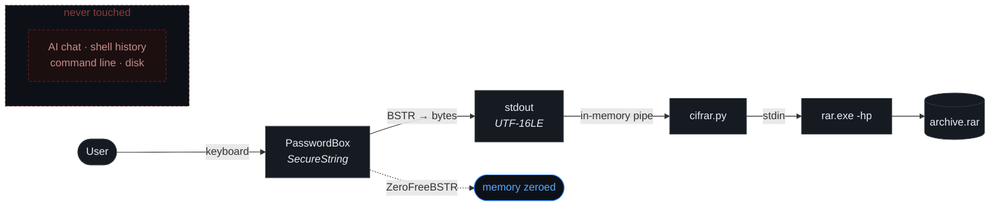

<div align="center">

# Parchecker

**The password does not pass through here.**


A window asks for the password. The program that orchestrated it never sees the text.

</div>

---

## The problem

To have an AI assistant encrypt a file for you, you have to dictate the password.

At that moment it stops being yours. It is in the conversation history, in the provider's logs, in the shell history, and in the process command line — where **any program on the machine can read it** with a single `Get-Process`.

There is no way to take it back. There is only avoiding writing it there.

---

## Usage

```powershell
python cifrar/cifrar.py backup.rar sensitive-folder/ --verificar
```

The window opens. Type the password. The encrypted `.rar` appears.

> [!NOTE]
> With `-hp`, **filenames are encrypted too**. Without the password you cannot even list what is inside.



---

## The password enters through stdin

`rar.exe a -hp` **with no value attached** reads the password from stdin. That is the entire mechanism: it travels through an in-memory pipe and never appears as a process argument.

From the WinRAR manual, section on the `-p` switch:

> *"You may also use file redirection or input streams to specify a password if the parameter is missing."*

> [!IMPORTANT]
> **7-Zip cannot do this.** It requires `-pMyPassword` as an argument, visible to the whole system. That is why the format here is `.rar`.

<details>
<summary><b>Two rules the manual does not mention</b></summary>

<br>

**1. The password is sent exactly once.**

RAR asks for confirmation when creating an archive, and the instinct is to send it twice through the pipe. Doing so makes RAR treat both lines as **one password**, and the archive never opens again.

No error message. No different exit code. The file is created, looks correct, and is lost.

**2. RAR expects the system ANSI codepage, not the console one.**

A Spanish Windows console runs `cp850`. That is the obvious candidate and the wrong one: RAR interprets the password as `cp1252`.

With the wrong encoding, any password containing `ñ` or an accent produces a `.rar` that WinRAR's own GUI **cannot open** — and you find out the day you need it.

Determined without opening the GUI: create an archive passing the password through `argv` — exactly what the GUI does — then test which stdin encoding opens it.

| stdin | result |
|---|---|
| `cp850` | rejected |
| `cp437` | rejected |
| **`cp1252`** | **opens** |
| `utf-8` | rejected |
| `utf-16-le` | rejected |

The code does not hardcode the constant: it reads the actual system ANSI codepage with `GetACP()`.

</details>

---

## Architecture

| Component | Responsibility |
|---|---|
| `askpass/Askpass.ps1` | Asks for a secret in a window. Writes it to stdout. Nothing else |
| `askpass/AskpassConsola.ps1` | The same, drawn with characters in the terminal |
| `askpass/askpass.cmd` | Shim for `GIT_ASKPASS` / `SSH_ASKPASS` |
| `cifrar/cifrar.py` | Builds the `.rar`, feeding `rar.exe` through stdin |
| [`sobre/`](sobre/) | The same idea in Rust, without WinRAR |
| `tools/higiene.py` | Catches invisible characters before every commit |
| `tools/BuscarFuga.ps1` | Searches for your password where it should not be, without leaking it |
| `tools/Comprobar.ps1` | Checks the environment and says how to fix what is missing |
| `pruebas/` | The full round-trip, without opening the window |

The askpass **does not know what the secret is for**. It asks, hands it over, and exits.

This is the Unix `SSH_ASKPASS` pattern, which means the same window serves any tool that asks for a password:

```cmd
set GIT_ASKPASS=C:\path\Parchecker\askpass\askpass.cmd
set SSH_ASKPASS=C:\path\Parchecker\askpass\askpass.cmd
set SSH_ASKPASS_REQUIRE=force
```

Or standalone, from any script:

```powershell
$key = & .\askpass\Askpass.ps1 -Titulo "Backup" -Mensaje "Backup password" -Texto
```

---

## The window

**Native WPF `PasswordBox`.** Not a text field with a homemade mask.

**It does not appear in screenshots.** `SetWindowDisplayAffinity` with `WDA_EXCLUDEFROMCAPTURE`: you see it normally. A screenshot, a recording, a shared screen in Meet or Zoom, or an AI looking at the desktop, all see a black rectangle.

**The secret never exists as text.** It is read from `SecurePassword`, converted to bytes through a BSTR, and freed with `ZeroFreeBSTR`, which overwrites with zeros.

It follows the system light or dark theme, warns about Caps Lock, measures entropy while typing, and with `-Confirmar` requires typing it twice.

### Console variant

```
python cifrar/cifrar.py backup.rar folder/ --consola
```

Opens nothing. Draws the window with characters in the terminal you were already in:

```
╔══════════════════════════════════════════════════════╗
║  Parchecker  ·  Cifrar backup.rar                    ║
╠══════════════════════════════════════════════════════╣
║                                                      ║
║  Contraseña para el archivo:                         ║
║                                                      ║
║  ┌────────────────────────────────────────────────┐  ║
║  │ ●●●●●●●●●●●●●●_                                │  ║
║  └────────────────────────────────────────────────┘  ║
║                                                      ║
║  y de nuevo, para estar seguros:                     ║
║  ┌────────────────────────────────────────────────┐  ║
║  │ ●●●●●●●●●●●●●●                                 │  ║
║  └────────────────────────────────────────────────┘  ║
║                                                      ║
║  ████████████████████████████████░░░░░░░░  72 bits   ║
║  ⚠ Bloq Mayus activado                               ║
║                                                      ║
╟──────────────────────────────────────────────────────╢
║  Enter aceptar   Esc cancelar   F2 ver   ^U limpiar  ║
╚══════════════════════════════════════════════════════╝
```

Same guarantees, same entropy meter, same Caps Lock warning, same double-entry confirmation. It never echoes what is typed: it reads key by key with `ReadKey` and draws the dots.

> [!IMPORTANT]
> **The interface is drawn on `stderr`.** That is the only way to keep `stdout` clean for the secret. Drawing on `stdout` would send the entire window, mixed with the password, to whoever pipes the result.

<details>
<summary><b>Why two scripts and not one with an <code>if</code></b></summary>

<br>

`Askpass.ps1` and `AskpassConsola.ps1` implement the **same contract**: ask for a secret, write it to stdout as raw UTF-16LE, exit `0` accepted, `1` cancelled, `2` error.

They are interchangeable. `cifrar.py` picks one in a single line and knows nothing else about either. That is what makes the askpass reusable by `git` and `ssh`: it is not coupled to its caller, nor the caller to it.

With one script and a flag, the contract would be an internal convention instead of a real boundary. Two swappable implementations are the proof that the boundary exists.

</details>

<details>
<summary><b>Character negotiation</b></summary>

<br>

A Spanish Windows console starts in **cp850**. The frames `╔═╗║` `┌─┐│` and the blocks `█▓▒░` **do exist** there — they have been part of the codepage since MS-DOS — but `●`, `⚠`, rounded corners and arrows **do not**: they come out as question marks.

The script tries to switch the console to UTF-8 and checks whether it succeeded, then picks the glyph set accordingly. `-Ascii` forces the poorest set, for unusual terminals:

```
+======================================================+
|  Parchecker  -  Cifrar backup.rar                    |
+======================================================+
|                                                      |
|  Contrasena para el archivo:                         |
|                                                      |
|  +------------------------------------------------+  |
|  | **************                                 |  |
|  +------------------------------------------------+  |
|                                                      |
|  ################################........  72 bits   |
|  ! Bloq Mayus activado                               |
|                                                      |
+------------------------------------------------------+
|  Enter aceptar   Esc cancelar   F2 ver   ^U limpiar  |
+======================================================+
```

Tees come in two flavors and the right one must be used: `╠╣` when the crossing line is double, `╟╢` when it is single. Mixing them leaves a visible notch in the border.

To see it without typing anything: `.\askpass\AskpassConsola.ps1 -Demo`

</details>

> [!WARNING]
> The console variant **needs a real terminal**. With redirected input it cannot read the keyboard, detects that, and exits `2` saying to use the graphical one. And in **Windows Terminal**, capture exclusion may not apply: `GetConsoleWindow` returns a hidden window that is not the visible one. It works in `conhost`.

---

## Threat model

Stated, with no promises beyond it.

| | |
|---|---|
| **Protects against** | The password ending up in an AI chat history · in shell history · in a command line visible to other processes · in a temporary file · in a screenshot |
| **Does not protect against** | A keylogger · an already-compromised machine · someone reading over your shoulder · malware with privileges to read process memory |

> [!WARNING]
> There are **two places where memory wiping does not apply**, deliberately and documented in the code: when the reveal toggle is used, and in the `-Texto` mode that `git` and `ssh` require. In both the secret passes through a .NET `String`, which is immutable and cannot be overwritten.

If your machine is already compromised, this does not save it. Neither does anything else.

---

## Requirements

| | |
|---|---|
| Windows | 10 version 2004 or newer — it works below that, but warns it cannot hide from screen capture |
| WinRAR | Only for `cifrar.py`. The askpass does not need it |
| Python | 3.8+ |
| PowerShell | 5.1, the one Windows ships |

Rust toolchain for the binary: [`sobre/`](sobre/README.md#build).

> [!TIP]
> Step-by-step setup on a clean machine, both paths, and the eight rules the environment must satisfy: **[INSTALACION.md](INSTALACION.md)** *(Spanish)*.

---

## Verification

```bash
.\tools\Comprobar.ps1               # environment, with fixes for what is missing
python pruebas/test_roundtrip.py    # 21 checks, without opening the window
python tools/higiene.py .           # must come out clean
```

The round-trip covers ASCII passwords, passwords with accents and `ñ`, passwords with shell-breaking symbols (`" ' \ | & < > ^ %`), and 120-character passwords. That they are created. That they open with the correct password. That they **do not** open with the wrong one. That without the password the contents cannot even be listed.

<details>
<summary><b>Why there is an invisible-character hunter</b></summary>

<br>

Zero-width characters, bidi marks, exotic spaces and Unicode tags (`U+E0000`–`U+E007F`) are invisible in an editor but change the bytes. They break diffs, make `grep` miss what is right there, and sometimes crash a parser.

`tools/higiene.py` runs on every commit through a pre-commit hook and stops the commit when it finds one. The hook is versioned under `tools/hooks/`, but **git does not clone hooks**: enable it once per clone with `git config core.hooksPath tools/hooks` (see [INSTALACION.md](INSTALACION.md)).

It distinguishes the legitimate cases: a BOM in a `.ps1` is mandatory — without it PowerShell 5.1 reads the script as ANSI and breaks accents — and a variation selector attached to an emoji is part of the emoji.

</details>

---

## License

**Apache 2.0** — see [LICENSE](LICENSE).

Permissive like MIT, plus an explicit patent grant, a trademark clause, and an obligation to state changes. Use it for anything, including commercially. Just keep the copyright notice.

Earlier Spanish documentation: [`.old/README-ESP.md`](.old/README-ESP.md).

<div align="center">
<br>
<sub><b>Selv Core</b> · 2026</sub>
</div>
