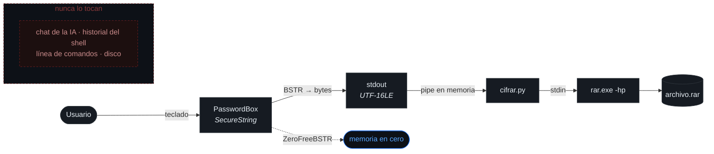

<div align="center">

# Parchecker

**La contraseña no pasa por acá.**


<sub>Una ventana pide la contraseña. El programa que la orquestó nunca ve el texto.</sub>

</div>

---

## El problema

Para que un asistente de IA le cifre un archivo, hay que dictarle la contraseña.

En ese momento la contraseña deja de ser suya. Queda en el historial de la
conversación. En los logs del proveedor. En el historial del shell. En la línea de
comandos del proceso, que **cualquier programa de la máquina puede leer** con un
`Get-Process`.

No hay forma de retirarla. Solo se puede evitar escribirla ahí.

---

## El recorrido



---

## Uso

```powershell
python cifrar/cifrar.py backup.rar carpeta-sensible/ --verificar
```

Se abre la ventana. Escribe la clave. Aparece el `.rar` cifrado.

> [!NOTE]
> Con `-hp`, los **nombres de los archivos también van cifrados**. Sin la clave no
> se puede ni listar qué hay adentro.

---

## El hallazgo

El manual de WinRAR, sección del modificador `-p`:

> *"También puede usar redirecciones de fichero o flujos de entrada para
> especificar la contraseña si falta el parámetro."*

`rar.exe a -hp` **sin valor pegado** lee la clave por **stdin**. Ese es el
mecanismo entero: la contraseña viaja por un pipe en memoria y jamás aparece como
argumento de proceso.

> [!IMPORTANT]
> **7-Zip no puede hacer esto.** Exige `-pMiClave` como argumento, visible para
> todo el sistema. Por eso acá el formato es `.rar`.

<details>
<summary><b>Dos trampas que solo aparecen probando</b></summary>

<br>

**1. La clave se manda una sola vez.**

RAR pide confirmación al crear un archivo, y el instinto es mandarla dos veces por
el pipe. Si lo hace, RAR toma las dos líneas como **una sola clave** y el archivo
no vuelve a abrir jamás.

Sin mensaje de error. Sin código de salida distinto. El archivo se crea, parece
correcto, y está perdido.

**2. RAR espera la codepage ANSI del sistema, no la de la consola.**

La consola en Windows en español corre en `cp850`. Es el candidato obvio, y es el
equivocado: RAR interpreta la clave en `cp1252`.

Con la codificación errónea, cualquier contraseña con `ñ` o tilde genera un `.rar`
que la interfaz gráfica de WinRAR **no puede abrir**. Y se descubre el día que se
lo necesita.

Se determina sin abrir la GUI: se crea un archivo pasando la clave por `argv`
—que es exactamente lo que hace la interfaz gráfica— y se prueba cuál codificación
de stdin lo abre.

| stdin | resultado |
|---|---|
| `cp850` | rechazado |
| `cp437` | rechazado |
| **`cp1252`** | **abre** |
| `utf-8` | rechazado |
| `utf-16-le` | rechazado |

El código no fija la constante: lee la ANSI real del sistema con `GetACP()`.

</details>

---

## Arquitectura

| Pieza | Responsabilidad |
|---|---|
| `askpass/Askpass.ps1` | Pide un secreto en una ventana. Lo escribe por stdout. Nada más. |
| `askpass/AskpassConsola.ps1` | Lo mismo, dibujado con caracteres en la terminal |
| `askpass/askpass.cmd` | Shim para `GIT_ASKPASS` / `SSH_ASKPASS` |
| `cifrar/cifrar.py` | Arma el `.rar` alimentando a `rar.exe` por stdin |
| `sobre/` | La misma idea en Rust, sin depender de WinRAR |
| `tools/higiene.py` | Caza caracteres invisibles antes de cada commit |
| `tools/BuscarFuga.ps1` | Busca tu clave donde no debería estar, sin filtrarla |
| `tools/Comprobar.ps1` | Revisa el entorno y dice cómo arreglar lo que falte |
| `pruebas/` | El roundtrip completo, sin abrir la ventana |

El `askpass` **no sabe para qué se usa el secreto**. Lo pide, lo entrega y se va.

Es el patrón `SSH_ASKPASS` de Unix, y significa que la misma ventana le sirve a
cualquier herramienta que pida una contraseña:

```cmd
set GIT_ASKPASS=C:\ruta\Parchecker\askpass\askpass.cmd
set SSH_ASKPASS=C:\ruta\Parchecker\askpass\askpass.cmd
set SSH_ASKPASS_REQUIRE=force
```

O suelto, desde cualquier script:

```powershell
$clave = & .\askpass\Askpass.ps1 -Titulo "Backup" -Mensaje "Clave del respaldo" -Texto
```

---

## La ventana

**`PasswordBox` nativo de WPF.** No un campo de texto con máscara casera.

**No aparece en las capturas de pantalla.** `SetWindowDisplayAffinity` con
`WDA_EXCLUDEFROMCAPTURE`: usted la ve normal. Un screenshot, una grabación, una
pantalla compartida de Meet o Zoom, o una IA mirando el escritorio, ven un
rectángulo negro.

**El secreto no existe como texto.** Se lee de `SecurePassword`, se convierte a
bytes por BSTR y se libera con `ZeroFreeBSTR`, que sobreescribe con ceros.

Sigue el tema claro u oscuro del sistema. Avisa si está el Bloq Mayús. Mide la
entropía mientras se escribe. Con `-Confirmar`, exige tipearla dos veces.

---

## La misma ventana, dibujada en la consola

```
python cifrar/cifrar.py backup.rar carpeta/ --consola
```

No abre nada. Dibuja la ventana con caracteres, en la terminal donde ya estaba:

```
╔══════════════════════════════════════════════════════╗
║  Parchecker  ·  Cifrar backup.rar                    ║
╠══════════════════════════════════════════════════════╣
║                                                      ║
║  Contraseña para el archivo:                         ║
║                                                      ║
║  ┌────────────────────────────────────────────────┐  ║
║  │ ●●●●●●●●●●●●●●_                                │  ║
║  └────────────────────────────────────────────────┘  ║
║                                                      ║
║  y de nuevo, para estar seguros:                     ║
║  ┌────────────────────────────────────────────────┐  ║
║  │ ●●●●●●●●●●●●●●                                 │  ║
║  └────────────────────────────────────────────────┘  ║
║                                                      ║
║  ████████████████████████████████░░░░░░░░  72 bits   ║
║  ⚠ Bloq Mayus activado                               ║
║                                                      ║
╟──────────────────────────────────────────────────────╢
║  Enter aceptar   Esc cancelar   F2 ver   ^U limpiar  ║
╚══════════════════════════════════════════════════════╝
```

Mismas garantías, misma medición de entropía, mismo aviso de Bloq Mayús, misma
confirmación por doble tipeo. Nunca hace eco de lo que se teclea: lee tecla por
tecla con `ReadKey` y dibuja los puntos.

> [!IMPORTANT]
> **La interfaz se dibuja por `stderr`.** Es la única forma de que `stdout` quede
> limpio para el secreto. Si el dibujo saliera por `stdout`, quien pipea el
> resultado recibiría la ventana entera mezclada con la contraseña.

<details>
<summary><b>Por qué son dos scripts y no uno con un <code>if</code></b></summary>

<br>

`Askpass.ps1` y `AskpassConsola.ps1` implementan el **mismo contrato**: piden un
secreto, lo escriben por stdout como UTF-16LE crudo, y salen con `0` aceptado,
`1` cancelado, `2` error.

Son intercambiables. `cifrar.py` elige cuál correr con una línea, y no sabe nada
más de ninguna de las dos. Eso es lo que hace que el `askpass` sea reusable por
`git` y por `ssh`: no está acoplado a quien lo llama, ni al revés.

Si fuera un solo script con una bandera, el contrato sería una convención interna
en vez de una frontera real. Dos implementaciones que se pueden cambiar de lugar
son la prueba de que la frontera existe.

</details>

<details>
<summary><b>La negociación de caracteres</b></summary>

<br>

La consola de Windows en español arranca en **cp850**. Ahí los marcos `╔═╗║`
`┌─┐│` y los bloques `█▓▒░` **sí existen** —son parte de la codepage desde MS-DOS—
pero `●`, `⚠`, las esquinas redondeadas y las flechas **no**: salen como signos de
pregunta.

El script intenta pasar la consola a UTF-8 y verifica si lo logró. Según el
resultado elige el juego de glifos. Con `-Ascii` se fuerza el más pobre, por si la
terminal es rara:

```
+======================================================+
|  Parchecker  -  Cifrar backup.rar                    |
+======================================================+
|                                                      |
|  Contrasena para el archivo:                         |
|                                                      |
|  +------------------------------------------------+  |
|  | **************                                 |  |
|  +------------------------------------------------+  |
|                                                      |
|  ################################........  72 bits   |
|  ! Bloq Mayus activado                               |
|                                                      |
+------------------------------------------------------+
|  Enter aceptar   Esc cancelar   F2 ver   ^U limpiar  |
+======================================================+
```

Detalle que se nota cuando está mal: los tees vienen en dos sabores. Si la línea
que cruza es doble va `╠╣`, y si es simple va `╟╢`. Mezclarlos deja un diente
visible en el borde.

Para verlo sin tipear nada: `.\askpass\AskpassConsola.ps1 -Demo`

</details>

> [!WARNING]
> La versión de consola **necesita una terminal de verdad**. Si la entrada está
> redirigida no puede leer el teclado, lo detecta y sale con código `2` diciendo
> que se use la gráfica. Y en **Windows Terminal**, la exclusión de capturas puede
> no aplicar: `GetConsoleWindow` devuelve una ventana oculta que no es la que se
> ve. En `conhost` funciona.

---

## Modelo de amenaza

Declarado, sin promesas de más.

| | |
|---|---|
| **Protege contra** | Que la contraseña quede en el historial de un chat con una IA · en el historial del shell · en la línea de comandos visible para otros procesos · en un archivo temporal · en una captura de pantalla |
| **No protege contra** | Un keylogger · una máquina ya comprometida · alguien mirando por encima del hombro · malware con privilegios para leer la memoria del proceso |

> [!WARNING]
> Hay **dos lugares donde el borrado de memoria no aplica**, a propósito y
> documentados en el código: cuando se toca el ojito para revelar la clave, y en
> el modo `-Texto` que exigen `git` y `ssh`. En ambos el secreto pasa por un
> `String` de .NET, que es inmutable y no se puede sobreescribir.

Si su máquina ya está tomada, esto no la salva. Ninguna otra cosa tampoco.

---

## Requisitos

| | |
|---|---|
| Windows | 10 versión 2004 o superior — sin eso funciona igual, pero avisa que no puede ocultarse de las capturas |
| WinRAR | Solo para `cifrar.py`. El `askpass` no lo necesita |
| Python | 3.8+ |
| PowerShell | 5.1, el que ya viene con Windows |

Para el binario en Rust, el toolchain está en [`sobre/`](sobre/README.md#compilar).

> [!TIP]
> Instalación paso a paso en una máquina limpia, los dos caminos y las ocho
> reglas que tiene que cumplir el entorno:
> **[INSTALACION.md](INSTALACION.md)**.

---

## Verificación

```bash
.\tools\Comprobar.ps1               # el entorno, con el arreglo de lo que falte
python pruebas/test_roundtrip.py    # 21 chequeos, sin abrir la ventana
python tools/higiene.py .           # tiene que salir limpio
```

El roundtrip valida claves ASCII, con acentos y `ñ`, con símbolos que rompen
shells (`" ' \ | & < > ^ %`) y de 120 caracteres. Que creen. Que abran con la
clave correcta. Que **no** abran con la equivocada. Que sin la clave no se pueda
ni listar el contenido.

<details>
<summary><b>Por qué hay un cazador de caracteres invisibles</b></summary>

<br>

Zero-width, marcas bidi, espacios exóticos y tags Unicode (`U+E0000`–`U+E007F`)
son invisibles en el editor pero cambian los bytes. Rompen diffs, hacen que `grep`
no encuentre lo que está ahí, y a veces revientan el parser.

`tools/higiene.py` corre en cada commit vía hook de pre-commit y frena el commit
si encuentra alguno. El hook está versionado en `tools/hooks/`, pero **git no
clona los hooks**: hay que activarlo una vez por clon con
`git config core.hooksPath tools/hooks` (ver [INSTALACION.md](INSTALACION.md)).

Distingue lo legítimo: el BOM de un `.ps1` es obligatorio
—sin él, PowerShell 5.1 lee el script como ANSI y rompe los acentos— y un
selector de variación pegado a un emoji es parte del emoji.

</details>

---

## Licencia

**Apache 2.0** — ver [LICENSE](LICENSE).

Permisiva como MIT, y además con concesión explícita de patentes, cláusula de
marca y obligación de declarar los cambios. Úselo en lo que quiera, incluso
comercialmente. Solo mantenga el aviso de copyright.

<div align="center">
<br>
<sub><b>Selv Core</b> · 2026</sub>
</div>
